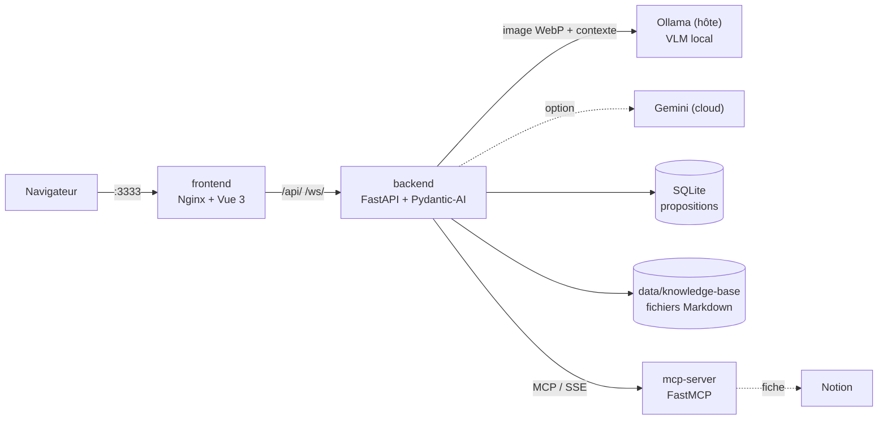
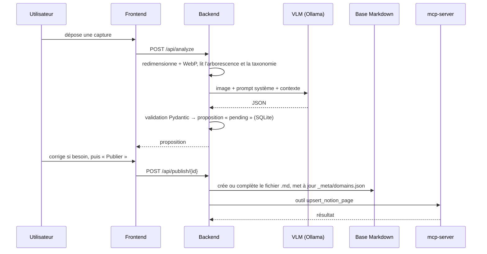

# 🧠 Assistant Cognitif V2

Application web qui transforme des captures d'écran en base de connaissances
structurée. Un modèle de vision local (VLM) analyse chaque image et propose une
fiche typée, suivie en base SQLite jusqu'à sa validation humaine. Une fois
validée, elle est classée par domaine dans une base Markdown. Un connecteur MCP
se charge de la publication vers Notion.


-000000?style=flat-square&logo=ollama&logoColor=white)

-5A45FF?style=flat-square)


> **Projet personnel (2026), jamais mis en production.** Il fonctionne en local
> avec Docker Compose. Voir [Statut et limites connues](#statut-et-limites-connues).

**Sommaire** — [Aperçu](#aperçu) · [Architecture](#architecture) ·
[Fonctionnalités](#fonctionnalités) · [Prérequis](#prérequis) ·
[Installation et lancement](#installation-et-lancement) · [Déploiement](#déploiement) ·
[Structure du projet](#structure-du-projet) · [Statut](#statut-et-limites-connues) ·
[Auteur](#auteur)

---

## Aperçu

Les captures d'écran s'accumulent — un extrait de code, un schéma
d'architecture, une recommandation de film — et ne sont jamais relues.
L'Assistant Cognitif les transforme en notes Markdown rangées par domaine,
réutilisables pour réviser.

La V2 reprend l'idée de la V1 (des scripts en ligne de commande avec
Gemini) sous la forme d'une application web conteneurisée :

- l'analyse passe par un **modèle de vision local** (Ollama), Gemini restant
  disponible en option ;
- chaque proposition de l'IA passe par une **validation humaine** dans
  l'interface, où tout champ peut être corrigé avant l'écriture ;
- les images peuvent être envoyées **par lots**, traitées en arrière-plan, avec
  une notification WebSocket en fin de lot ;
- la publication appelle un **connecteur MCP** qui crée la fiche dans une base
  Notion (écriture réelle pas encore intégrée à ce dépôt, voir
  [Statut](#statut-et-limites-connues)).

### Principe : le modèle lit, le code décide

Le modèle ne fait que lire l'image et proposer. Sa réponse est validée contre
un schéma Pydantic (`ProposalResult` : action `create` / `append` / `ignore`,
domaine, tags, contenu), puis stockée comme proposition **en attente**. Rien
n'est écrit dans la base de connaissances tant qu'un humain n'a pas cliqué sur
« Publier » ; l'écriture du fichier, la mise à jour de la taxonomie et l'appel
au connecteur sont faits par du code déterministe (`backend/app/executor.py`).

---

## Architecture

Trois services Docker Compose sur un réseau `cognitif_net`. Le frontend est
servi par Nginx, qui fait aussi office de reverse proxy vers le backend pour
`/api/` et `/ws/` : le navigateur ne parle qu'à une seule origine. Le modèle
de vision tourne sur la machine hôte (Ollama), joint par
`host.docker.internal`.



### Flux d'une capture



1. **Préparation de l'image.** Pillow réduit l'image (côté maximal
   `IMAGE_RESOLUTION`, 768 px par défaut) et la convertit en WebP
   (`IMAGE_QUALITY`, 65 par défaut) pour limiter la charge du modèle.
2. **Injection de contexte.** `utils/tree_helper.py` fournit au modèle la
   taxonomie (`_meta/domains.json`) et la liste des fichiers Markdown existants
   avec leur chemin relatif, pour qu'il puisse choisir `append` vers un fichier
   réel plutôt que d'en créer un doublon.
3. **Appel au modèle.** Le prompt système (`app/core/instructions.md`) fixe
   les règles de routage et de rédaction ; un gabarit JSON impose le format de
   sortie. Ollama est appelé via son API compatible OpenAI (`/v1`).
4. **Parsing robuste.** La réponse est nettoyée (balises de code, texte autour
   des accolades) puis validée par Pydantic. Un JSON invalide est journalisé et
   renvoie une erreur en mode unitaire ; en mode lot, l'image reste dans
   l'inbox pour une prochaine tentative.
5. **Validation humaine.** La proposition est stockée en SQLite avec le statut
   `pending` et affichée dans l'interface, avec le raisonnement du modèle.
6. **Écriture.** À la publication, le fichier est créé
   (`<domaine>/<titre>.md`) ou complété, avec un en-tête daté, les tags et la
   justification ; les nouveaux domaines et tags sont ajoutés à la taxonomie.

### Le connecteur MCP

`mcp-server` est un serveur [MCP](https://modelcontextprotocol.io) écrit avec
FastMCP, exposé en SSE sur le port interne 8000. Il publie un outil,
`upsert_notion_page`, dont l'entrée est typée (`title`, `tags`,
`markdown_content`). Le backend l'appelle avec le client MCP de FastMCP
(`http://cognitif_mcp:8000/sse`). L'intégration Notion est ainsi isolée dans
son propre service, réutilisable par tout client MCP. La création de la page
Notion (titre, tags, statut « Approved », contenu Markdown) est implémentée,
mais **pas encore intégrée à ce dépôt** : dans cette version, l'outil vérifie
la présence des clés, journalise et renvoie un succès simulé.

---

## Fonctionnalités

| Fonctionnalité | Où |
|---|---|
| Analyse d'une capture unique (glisser-déposer) | `POST /api/analyze` |
| Envoi par lots dans l'inbox, puis traitement séquentiel en arrière-plan | `POST /api/upload/inbox`, `POST /api/analyze/batch` |
| Notification de fin de lot en temps réel | WebSocket `/ws/batch-status` |
| Tableau des propositions en attente | `GET /api/proposals`, page `/proposals` |
| Revue et correction (titre, domaine, action, tags, fichier cible, contenu) | page de revue |
| Publication ou rejet | `POST /api/publish/{id}`, `POST /api/reject/{id}` |
| Paramètres modifiables à chaud (fournisseur, modèle, température, DRY_RUN, résolution, qualité) | `GET/POST /api/settings`, panneau « Paramètres Moteur » |
| Mode DRY_RUN : aucun appel IA, prompt complet et estimation de tokens dans les logs | paramètre `DRY_RUN` |
| Images triées après un lot : `archive/` (proposition créée) ou `trash/` (`ignore`) | `data/` |
| Journaux Loguru avec rotation (10 Mo, 10 jours) et gestionnaire d'exceptions global | `data/logs/` |
| Healthcheck Docker | `GET /health` |

Le traitement par lots est volontairement **séquentiel** : un modèle de vision
local ne supporte pas plusieurs inférences simultanées sans saturer la VRAM.

---

## Prérequis

| Outil | Version |
|---|---|
| Docker Engine / Docker Desktop | avec Docker Compose v2 (`docker compose`) |
| Ollama | installé **sur la machine hôte**, avec un modèle de vision |
| Modèle de vision | `gemma4:e4b` par défaut (modifiable via `OLLAMA_MODEL`) |
| Clé API Gemini | seulement pour le mode `gemini` |
| Clé et base Notion | facultatives : dans cette version du dépôt, l'écriture Notion est simulée |

Images utilisées par les Dockerfiles : `python:3.11-slim` (backend,
mcp-server), `node:22-alpine` puis `nginx:alpine` (frontend, build
multi-étapes).

> Les chemins de données sont fixés à `/app/data` dans le code : l'application
> est conçue pour tourner dans Docker, pas directement sur l'hôte.

---

## Installation et lancement

```bash
# 1. Cloner le dépôt
git clone https://github.com/NABIHAyman/Assistant_Cognitif_V2.git
cd Assistant_Cognitif_V2

# 2. Préparer le modèle de vision sur l'hôte
ollama pull gemma4:e4b

# 3. Créer la configuration
cp .env.example .env
#    (ajuster les ports ou le modèle si besoin)

# 4. Construire et lancer les trois services
docker compose up -d --build

# 5. Suivre le démarrage
docker compose ps
docker compose logs -f backend
```

Le frontend attend que le backend soit déclaré sain (healthcheck) avant de
démarrer.

### Vérifier

| URL (ports par défaut) | Attendu |
|---|---|
| http://localhost:3333 | Interface « Cognition Web » |
| http://localhost:8020/health | `{"status": "ok"}` |
| http://localhost:8020/docs | Documentation OpenAPI de l'API |
| http://localhost:3333/api/proposals | Liste JSON des propositions en attente (via Nginx) |

### Arrêter

```bash
docker compose down
```

Les données restent dans `./data` sur l'hôte.

---

## Déploiement

### Services et ports

| Service | Conteneur | Port hôte (variable) | Port interne | Rôle |
|---|---|---|---|---|
| `frontend` | `cognitif_frontend` | 3333 (`FRONTEND_PORT`) | 80 | Nginx : application Vue, reverse proxy `/api/` et `/ws/` |
| `backend` | `cognitif_backend` | 8020 (`BACKEND_PORT`) | 8000 | FastAPI : analyse, propositions, écriture, paramètres |
| `mcp-server` | `cognitif_mcp` | 8021 (`MCP_PORT`) | 8000 | Serveur MCP (SSE) du connecteur Notion |
| Ollama | — (hôte) | — | 11434 | Modèle de vision, joint via `host.docker.internal` |

Seul le port du frontend est nécessaire pour utiliser l'application ; ceux du
backend et du serveur MCP servent au diagnostic.

### Variables d'environnement

Un seul fichier `.env` à la racine, lu par Docker Compose (ports) et chargé
dans `backend` et `mcp-server` (`env_file`). Modèle : `.env.example`.

| Variable | Service | Rôle |
|---|---|---|
| `FRONTEND_PORT`, `BACKEND_PORT`, `MCP_PORT` | compose | Ports exposés sur l'hôte |
| `LLM_PROVIDER` | backend | `ollama` ou `gemini` |
| `OLLAMA_MODEL` | backend | Modèle de vision Ollama |
| `LLM_TEMPERATURE` | backend | Température d'inférence |
| `GOOGLE_API_KEY` | backend | Clé Gemini (mode `gemini` seulement ; `GEMINI_API_KEY` accepté) |
| `IMAGE_RESOLUTION`, `IMAGE_QUALITY` | backend | Réduction et compression WebP |
| `DRY_RUN` | backend | Simulation sans appel IA |
| `NOTION_API_KEY`, `NOTION_DATABASE_ID` | mcp-server | Accès Notion |

`OLLAMA_HOST` est fixé dans `docker-compose.yml`
(`http://host.docker.internal:11434`).

> **Paramètres persistés.** Au premier démarrage, le backend enregistre ses
> paramètres dans `data/settings.json` ; ce fichier prime ensuite sur les
> variables d'environnement. Pour changer un paramètre, utiliser le panneau
> « Paramètres Moteur » (appliqué à chaud) ou supprimer `data/settings.json`
> avant de redémarrer.

### Données

Le volume `./data` (monté sur `/app/data`) contient tout l'état :

```
data/
├── knowledge-base/        # la base Markdown produite
│   ├── _meta/domains.json # taxonomie : domaines et tags autorisés
│   └── <domaine>/*.md
├── inbox/                 # images en attente de traitement par lot
├── archive/               # images traitées
├── trash/                 # images classées « ignore »
├── cognition.db           # propositions (SQLite)
├── settings.json          # paramètres persistés
└── logs/                  # journaux du backend
```

`data/` est exclu de Git.

### Reverse proxy

`frontend/nginx.conf` sert l'application compilée (avec repli sur
`index.html`), transmet `/api/` au backend, passe `/ws/` en WebSocket
(`Upgrade`) et met en cache les fichiers statiques.

### Ollama sous Linux

`extra_hosts: host.docker.internal:host-gateway` rend l'hôte joignable depuis
les conteneurs. Ollama doit alors écouter sur une interface accessible depuis
le réseau Docker, pas seulement sur `127.0.0.1`.

---

## Structure du projet

```
.
├── docker-compose.yml         # 3 services, réseau cognitif_net, volume ./data
├── .env.example               # modèle de configuration
├── backend/                   # FastAPI + Pydantic-AI
│   ├── Dockerfile
│   ├── requirements.txt
│   └── app/
│       ├── main.py            # routes API, agent IA, parsing, traitement par lots, WebSocket
│       ├── executor.py        # écriture Markdown, taxonomie, client MCP
│       ├── models.py          # SQLAlchemy : table des propositions (SQLite)
│       ├── config.py          # paramètres dynamiques (env → settings.json)
│       ├── core/instructions.md  # prompt système : routage et style de rédaction
│       └── utils/tree_helper.py  # contexte injecté : taxonomie + arborescence
├── frontend/                  # Vue 3 + Tailwind, servi par Nginx
│   ├── Dockerfile             # build Node puis image Nginx
│   ├── nginx.conf             # fichiers statiques + reverse proxy /api et /ws
│   └── src/App.vue            # dépôt, lots, propositions, revue, paramètres
├── mcp-server/                # connecteur Notion (FastMCP, SSE)
│   ├── Dockerfile
│   └── server.py              # outil upsert_notion_page (écriture Notion simulée dans ce dépôt)
└── docs/                      # notes de conception (français)
    ├── 01_parcours_fonctionnel/
    ├── 02_cerveau_ia/
    ├── 03_architecte_donnees/
    ├── 04_moteur_devops/
    ├── docker/
    ├── done/                  # fonctionnalités réalisées
    └── tasks/                 # feuille de route
```

---

## Statut et limites connues

Projet personnel, développé et utilisé en local. **Jamais mis en production.**

- **Écriture Notion pas encore intégrée à ce dépôt.** Le connecteur MCP est en
  place (serveur, outil typé, appel depuis le backend) et l'écriture dans Notion
  est implémentée, mais cette version n'est pas encore versionnée ici : le
  `server.py` du dépôt renvoie un succès simulé sans rien créer dans Notion.
- **Pas d'authentification.** L'application est mono-utilisateur ; toute
  personne qui atteint l'API voit et publie les propositions. À n'exposer que
  sur un réseau de confiance.
- **SQLite** convient à un usage personnel, pas à des écritures concurrentes.
- **Contexte injecté en texte brut.** L'arborescence complète est envoyée au
  modèle à chaque analyse ; avec une base très volumineuse, elle finira par
  dépasser la fenêtre de contexte.
- **Pas de tests automatisés.**
- **Dépendances Python non figées** (`>=` dans `requirements.txt`).

La feuille de route (`docs/tasks/tasks.md`) prévoit l'authentification
multi-utilisateur (JWT), une recherche vectorielle (RAG) à la place de
l'arborescence brute, et une migration vers PostgreSQL.

---

## Auteur

**Ayman NABIH**
[github.com/NABIHAyman](https://github.com/NABIHAyman) ·
[linkedin.com/in/nabihayman](https://linkedin.com/in/nabihayman) ·
[nabih.ayman.ai@gmail.com](mailto:nabih.ayman.ai@gmail.com)
